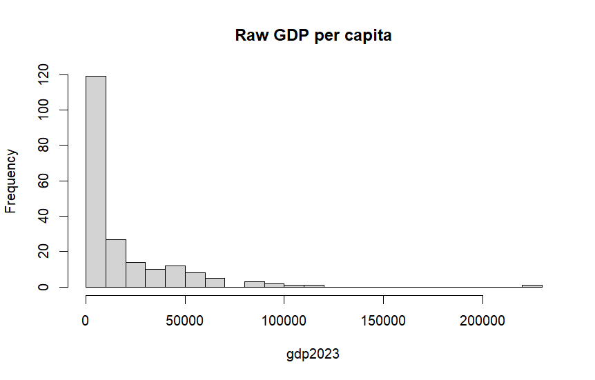
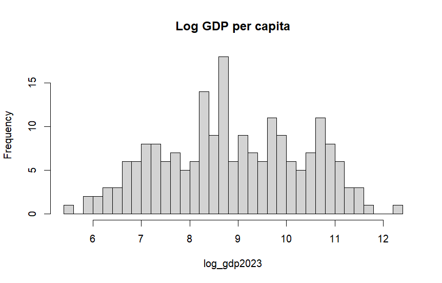
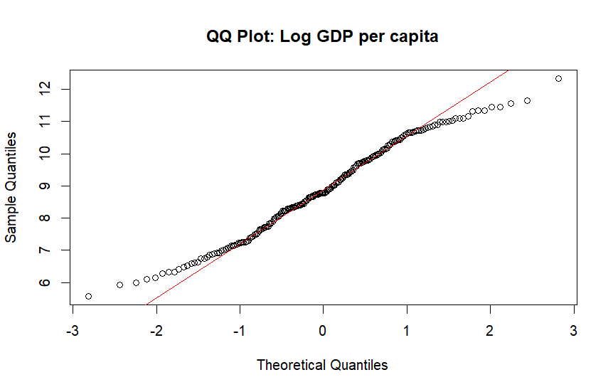
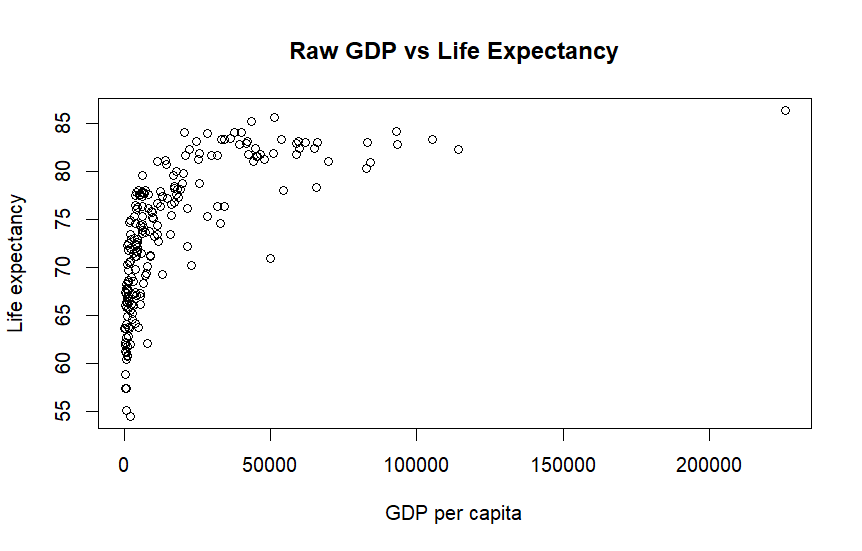
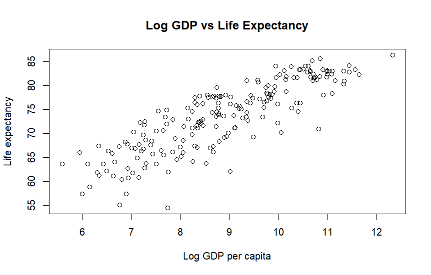
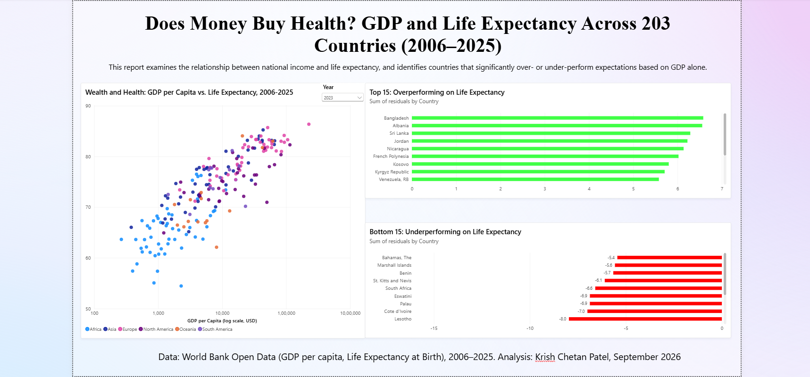

Global GDP Per Capita: Statistical Analysis & Power BI Dashboard

📌 Overview

Does money buy health? This project examines the relationship between national income (GDP per capita) and life expectancy across 203 countries from 2006–2025. Using R, the raw GDP data was cleaned, its distribution analyzed (and log-transformed to correct for strong skew), and a regression model was built to quantify how strongly income predicts life expectancy. The regression residuals were then used to identify which countries overperform or underperform on life expectancy relative to what their GDP alone would predict — surfacing standout cases like Bangladesh and Sri Lanka (achieving better health outcomes than their income would suggest) versus countries like Lesotho and Eswatini (underperforming relative to their income level). The findings are presented in an interactive Power BI dashboard.

📊 Data Source
Source: World Bank Open Data — GDP per capita (current US$) and Life Expectancy at Birth
Time period covered: 2006–2025
Countries/regions included: 203 countries, grouped by continent (Africa, Asia, Europe, North America, Oceania, South America)
Key variables: Country, Country Code, Year, GDP per capita, Life Expectancy at Birth
🛠️ Tools Used
R / RStudio — data cleaning, descriptive statistics, distribution analysis
R packages: moments (skewness, kurtosis), psych (descriptive statistics), ggplot2 (visualization)
Power BI — interactive dashboard and visual storytelling

🔎 R Analysis
1. Data Cleaning

GDP per capita and Life Expectancy data were sourced as separate CSV files and merged by Country.Code, resulting in 217 matched countries. Missing values in the raw data (e.g., ".." placeholders in the Life Expectancy file) were read in as NA using na.strings = "..". Rather than imputing or guessing values, the 14 countries with missing GDP data were excluded from calculations using na.rm = TRUE in summary statistics and use = "complete.obs" in correlation/regression — leaving 203 countries with complete data for the core analysis.

2. Descriptive Statistics

Summary statistics for GDP per capita (2023), across 203 countries with data (14 missing):

Statistic	Value (US$)
Minimum	264.8
1st Quartile	2,298.0
Median	6,497.8
Mean	18,205.1
3rd Quartile	22,059.2
Maximum	225,884.1
Standard Deviation	26,795.9
Variance	718,022,331
IQR	19,761.2

The mean ($18,205) is almost three times the median ($6,498) — a classic sign of a right-skewed distribution, where a handful of very high-income countries pull the average well above what's typical for most countries.

3. Distribution of Raw GDP Per Capita

The raw GDP per capita data is strongly right-skewed (positively skewed): most countries cluster at the lower end of the income scale, while a small number of high-income countries form a long tail stretching out to over $200,000 per capita.

Skewness = 3.36 — a value this far above 0 confirms strong positive (right) skew.
Kurtosis = 21.01 — far higher than the normal distribution's value of 3, meaning the data has extremely heavy tails driven by a few extreme high-GDP outliers (e.g., the single country near $225,000).

4. Log-Transformed GDP Per Capita

Because the raw data was so skewed, a log transformation was applied. This produces a much more symmetric, near bell-shaped distribution, making the data far more suitable for statistical analysis and comparison across countries.

Skewness = -0.04 — essentially 0, meaning the log-transformed data is nearly perfectly symmetric (compared to 3.36 before the transform).
Kurtosis = 2.15 — very close to the normal distribution's value of 3, confirming the log transform brought the shape of the data much closer to a standard bell curve.

This is a strong before/after result: log-transforming GDP per capita fixed both the skew and the extreme tail behavior.

5. Normality Check: QQ Plot

A QQ (quantile-quantile) plot was used to check how closely the log-transformed GDP per capita follows a normal distribution. The points follow the red reference line closely through the middle of the distribution, with only mild deviation at the lower tail — indicating the log transform brought the data reasonably close to normal, which is far better than the raw, heavily-skewed version.

6. Relationship Between GDP and Life Expectancy (Raw)

Plotting raw GDP per capita against life expectancy shows a clear non-linear, diminishing-returns pattern: life expectancy rises sharply as GDP per capita increases from low levels, but the curve flattens out — beyond a certain income level, additional GDP per capita buys very little extra life expectancy.

7. Relationship Between GDP and Life Expectancy (Log-Transformed)

When GDP per capita is log-transformed, its relationship with life expectancy becomes much more linear. This is a common and meaningful pattern in economics: it suggests that life expectancy relates more closely to proportional/percentage changes in income (e.g., doubling income) rather than to fixed dollar increases — a country going from $1,000 to $2,000 per capita sees a bigger life-expectancy gain than one going from $50,000 to $51,000.

8. Quantifying the Relationship: Correlation & Regression

To confirm what the scatterplots suggested visually, GDP per capita was merged with a life expectancy dataset (matched by country, 2023 data, 203 countries with complete data).

Correlation:

Raw GDP per capita vs Life Expectancy: r = 0.624
Log GDP per capita vs Life Expectancy: r = 0.851

The correlation is noticeably stronger after the log transform — confirming that life expectancy relates more closely to proportional changes in income than to raw dollar amounts.

Linear Regression Model:

life_expectancy = 36.73 + 4.16 × log(GDP per capita)
R² = 0.724 — log GDP per capita alone explains about 72% of the variation in life expectancy across countries.
The coefficient (4.16) means: every time a country's GDP per capita doubles, its life expectancy rises by roughly 4.16 × log(2) ≈ 2.9 years on average.
Both the intercept and slope are statistically significant (p < 0.001).

📈 Power BI Dashboard

Titled "Does Money Buy Health? GDP and Life Expectancy Across 203 Countries (2006–2025)," the dashboard turns the R regression analysis into an interactive tool for exploring which countries beat or fall short of health outcomes predicted by their income alone.

Dashboard preview: 

Key features of the dashboard:

Scatterplot (GDP per Capita vs. Life Expectancy): GDP per capita is shown on a log scale, colored by continent (Africa, Asia, Europe, North America, Oceania, South America), with a Year slicer (2006–2025) letting users see how the relationship has evolved over time.
Top 15 Overperforming Countries: A bar chart ranking countries by the sum of their regression residuals — i.e., countries whose actual life expectancy is higher than their GDP per capita would predict. Top performers include Bangladesh, Albania, Sri Lanka, and Jordan.
Bottom 15 Underperforming Countries: The mirror chart, showing countries whose life expectancy is lower than their GDP would predict — including Lesotho, Cote d'Ivoire, Palau, and Eswatini.

This residual-based view is the key insight the dashboard adds beyond the R analysis: it moves from "GDP and life expectancy are correlated" to "here are the specific countries where that relationship breaks down, and in which direction."

💡 Key Findings
Global GDP per capita is highly unequal. The mean ($18,205) is nearly 3× the median ($6,498), and skewness of 3.36 confirms a strongly right-skewed distribution — a small number of very high-income countries pull the global average far above what's typical.
Log transformation normalizes the data. After taking the log, skewness dropped from 3.36 to -0.04 and kurtosis dropped from 21.01 to 2.15 — both now close to what you'd expect from a normal distribution, making the data much more suitable for further statistical modeling.
GDP per capita and life expectancy are strongly linked — but not linearly. The relationship is weak-to-moderate in raw terms (r = 0.624) but becomes strong (r = 0.851) after log-transforming GDP, showing a classic diminishing-returns pattern: income gains matter most at lower income levels.
A country's income level statistically explains most of the variation in its life expectancy. The regression model (life expectancy ~ log GDP per capita) achieves an R² of 0.724, meaning income alone accounts for about 72% of the differences in life expectancy across the 203 countries studied.
Income isn't destiny — some countries defy expectations. Using the regression residuals, countries like Bangladesh, Albania, and Sri Lanka achieve notably higher life expectancy than their GDP per capita would predict, while countries like Lesotho, Cote d'Ivoire, and Eswatini fall short of what their income level would suggest — pointing to other factors (healthcare systems, public health policy, inequality) at play beyond income alone.

📁 Repository Structure
├── scripts/        # R scripts used for analysis
├── plots/          # Exported plots from R
├── powerbi/         # Power BI (.pbix) file and dashboard screenshots
└── README.md        # This file

🔁 How to Reproduce
Clone or download this repository.
Open the R script(s) in the scripts/ folder using RStudio.
Install required packages: install.packages(c('moments','psych','ggplot2'))
Run the script to reproduce the analysis and plots.
Open the .pbix file in the powerbi/ folder using Power BI Desktop to explore the dashboard.
